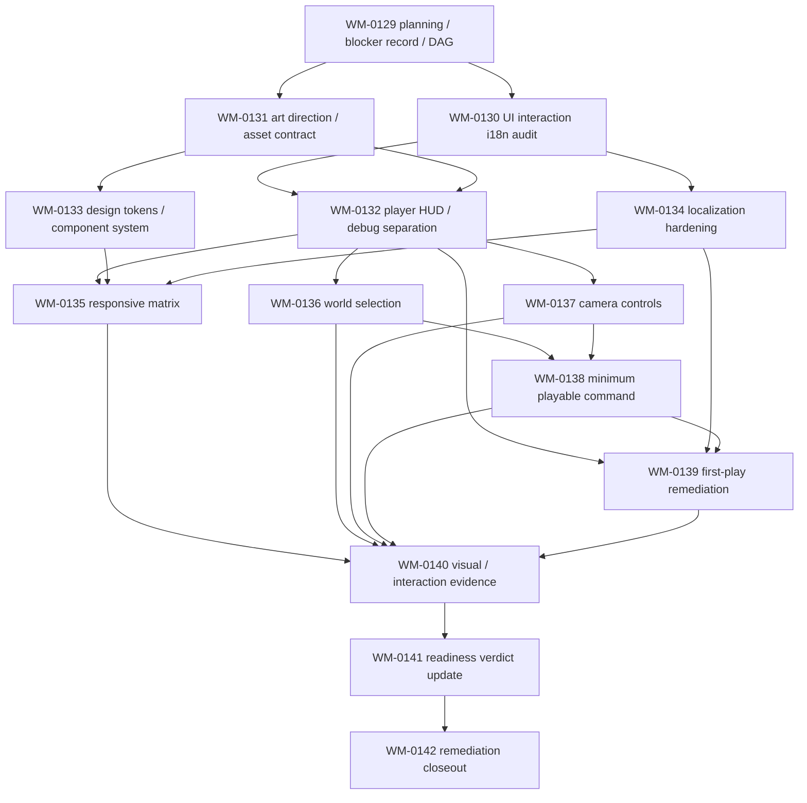

# WM-0129 Post-M8 UI / Playability Remediation DAG

This DAG is a post-M8 owner remediation phase. It is not M9, public release,
EA launch, store work, signing work, telemetry, account work, paid service work
or public save compatibility.

## Task List

| Task | Owner | Purpose |
| --- | --- | --- |
| WM-0130 | client-engineer | Current UI/interaction/i18n blocker matrix. |
| WM-0131 | systems-architect | Art-thread consultation, semantic slots and asset replacement contract. |
| WM-0132 | client-engineer | Default player HUD and explicit diagnostics separation. |
| WM-0133 | client-engineer | Design tokens and component styling system. |
| WM-0134 | client-engineer | zh-CN/en locale hardening and hardcoded string audit. |
| WM-0135 | client-engineer | Required responsive matrix and windowed/fullscreen evidence. |
| WM-0136 | client-engineer | Mouse selection for residents and map objects. |
| WM-0137 | client-engineer | Camera drag, wheel, keyboard and reset behavior. |
| WM-0138 | client-engineer | Minimum playable interaction command chain. |
| WM-0139 | gameplay-designer | First-play guidance tied to the real interaction chain. |
| WM-0140 | qa-performance | Screenshot/visual/interaction regression evidence. |
| WM-0141 | project-director | Post-remediation readiness verdict update. |
| WM-0142 | project-director | Final closeout after all tasks are verified/integrated. |

## Promotion Model

Only WM-0129 starts as `ready`. The downstream tasks start as `proposed` and
depend on verified/done upstream work. When WM-0129 is marked `done`,
`taskctl` may promote WM-0130 and WM-0131. No M9 or public-release task is
created.

## Owner Gates

The DAG explicitly does not approve:

- public release or release-candidate distribution;
- Early Access launch;
- store submission, store publication, final store copy or trailer;
- signing, installer, updater or public Windows build;
- public Web launch or Web verdict change;
- telemetry, analytics, crash upload, accounts, hosted feedback or paid
  services;
- public save compatibility or cross-version migration promises;
- external art licensing commitments.
